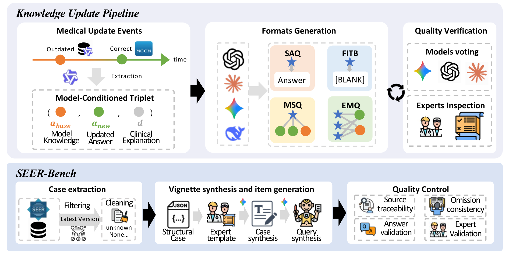
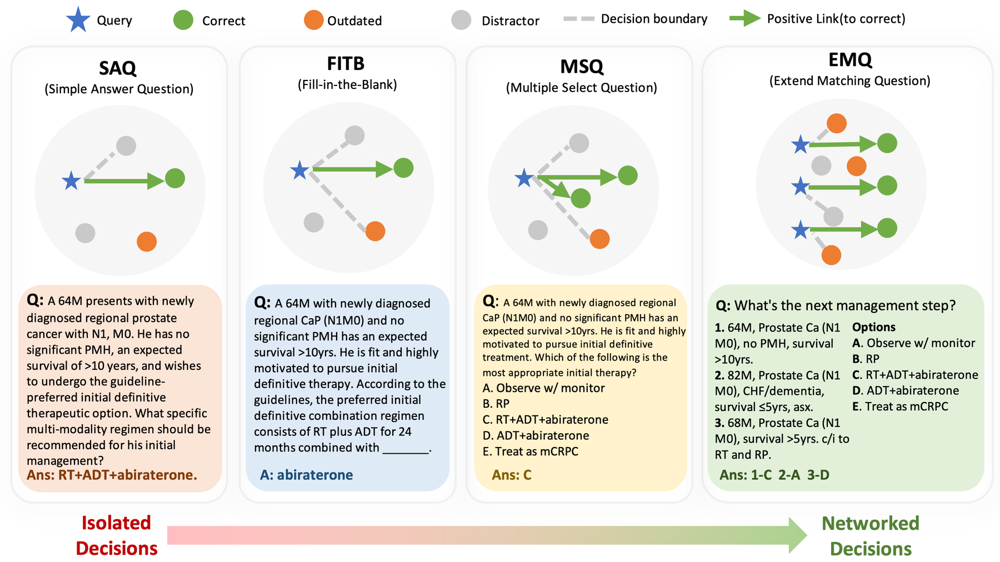

<!-- markdownlint-disable first-line-h1 -->
<!-- markdownlint-disable html -->

<h1 align="center">Dense Clinical Contrasts Enhance Medical Knowledge Updating in Large Language Models</h1>

EMNLP 2026

  
  
<i>Construction pipeline. Top: NCCN guideline changes become structured update units, then four verified supervision formats. Bottom: SEER Research Data cases become expert-reviewed staging items.</i>

--------------------------------------------------------------------------------

Medical knowledge changes continually, so a model trained on historical data can encode information that is clinically plausible but no longer current. This work asks how a knowledge update should be *represented as supervision* before adaptation. We render identical NCCN oncology update events into four supervision formats under a matched training budget, and evaluate on **SEER-Bench**, a temporally anchored oncology-staging benchmark built from a versioned SEER Research Data release.

--------------------------------------------------------------------------------

## How Current Systems Score on SEER-Bench

Answer accuracy requires an exact match to the masked staging target; rationale
accuracy additionally requires the explanation to reproduce the reference
clinical reasoning. Numbers are as reported in the paper, under a shared
prompting protocol. († medical LLMs)

| System | Answer Acc. | Rationale Acc. |
| :--- | :---: | :---: |
| Claude-Opus-4.6 | **67.3** | **64.2** |
| Gemini-3.1-Pro | 65.6 | 62.0 |
| GPT-5.4 | 65.1 | 63.4 |
| GLM-5 | 63.2 | 55.7 |
| DeepSeek-R1 | 62.3 | 58.5 |
| Kimi-2.5 | 60.6 | 51.9 |
| Qwen3-235B | 59.3 | 52.3 |
| HuatuoGPT-O1-70B † | 60.2 | 57.4 |
| MediTron-70B † | 58.1 | 49.5 |

--------------------------------------------------------------------------------

## The Four Supervision Formats

  
  
<i>SAQ, FITB, and MSQ expose isolated one-to-one or one-to-few decisions. EMQ introduces a networked structure, forcing the model to resolve many-to-many correspondences within a shared answer pool.</i>

Each update event is rendered into all four formats from the same clinical
vignette pool, so the only thing that varies is how the decision is structured.

| Format | Structure | What the model has to do |
| :--- | :--- | :--- |
| **SAQ** | Short answer | Produce the current recommendation with no candidates in view |
| **FITB** | Fill in the blank | Recover a masked span inside a clinical statement |
| **MSQ** | Multiple select | Choose among candidates that are local to a single vignette |
| **EMQ** | Extended matching | Match several vignettes against one shared option pool that mixes current and non-current answers |

--------------------------------------------------------------------------------

## Effect of the Supervision Format

Qwen3-4B updated with each format under a matched training budget. Not
comparable to the table above, which reports systems evaluated without
task-specific updating.

| Supervision | SEER-Bench Acc. | SEER-Bench Rationale Acc. | HealthBench |
| :--- | :---: | :---: | :---: |
| Base model (no update) | 57.6 | 50.7 | 0.247 |
| SAQ | 62.7 | 52.1 | 0.253 |
| FITB | 61.5 | 50.9 | 0.237 |
| MSQ | 61.7 | 55.1 | 0.243 |
| **EMQ** | **64.8** | **59.6** | **0.263** |

--------------------------------------------------------------------------------

## What's Here

This repository releases the benchmark, the format-rendered training corpora, and the prompts used to build and evaluate them.

| | Path | Contents |
| :--- | :--- | :--- |
| **Benchmark** | [`data/seer_bench/`](data/seer_bench/) | SEER-Bench: 1,992 staging cases with gold answers and rationales |
| **Prompts** | [`prompts/`](prompts/) | All eight construction, generation, and grading prompts |

See the [data card](data/README.md) for field schemas, provenance, and metric
definitions.

Vignettes are narratives synthesized from coded SEER fields, not SEER patient
records; gold labels come from the coded staging variables, not from a model.

--------------------------------------------------------------------------------

## License

Code is released under the [MIT License](LICENSE); everything under
[`data/`](data/) under [CC BY-NC 4.0](DATA_LICENSE), subject to the SEER
data-use terms and the NCCN Guidelines® terms of use described there.
